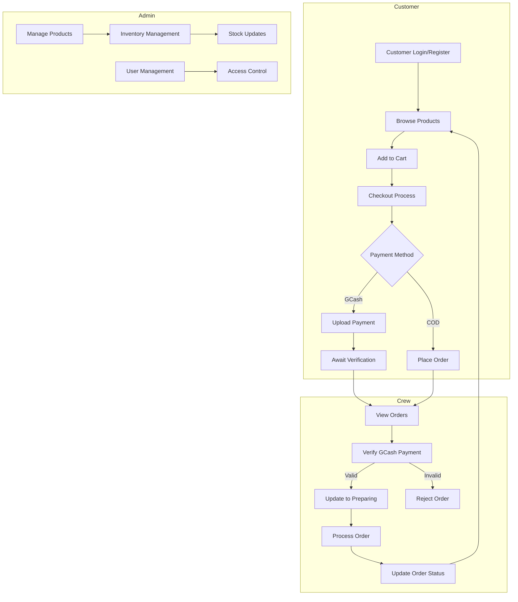
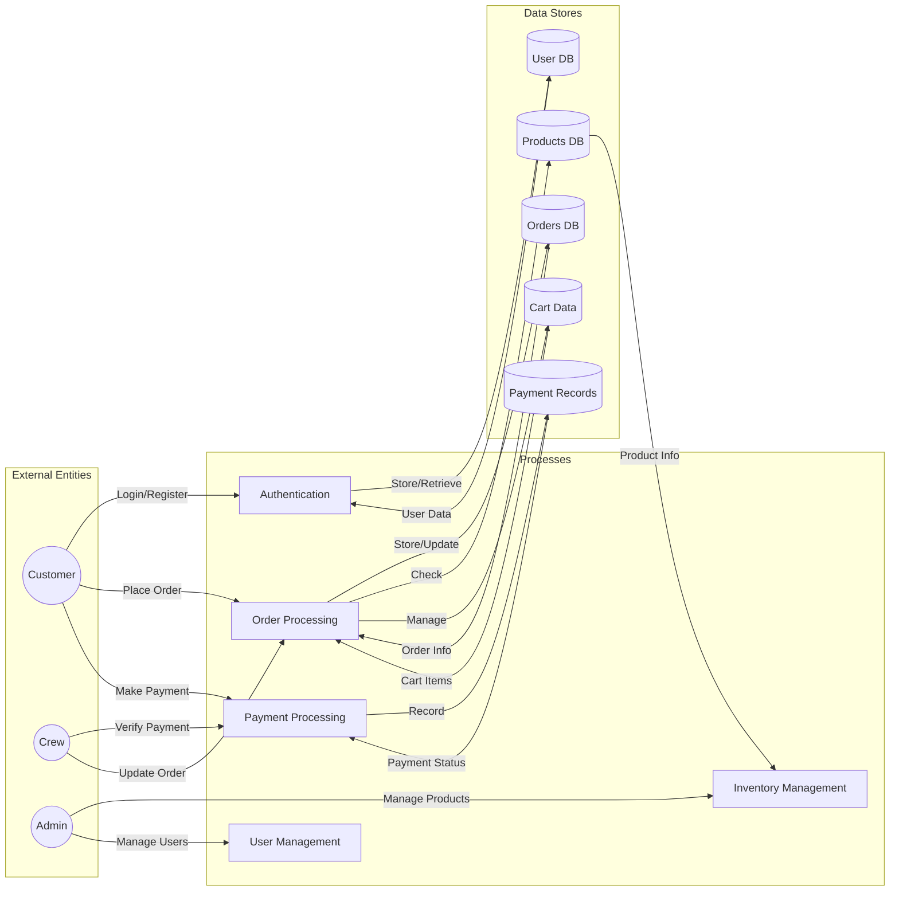

# K-Food Delights System Documentation

This document outlines the complete system architecture, process flows, and data flows of the K-Food E-commerce platform.

## System Overview

The K-Food E-commerce system is a comprehensive web-based platform that enables customers to browse, order, and pay for the product items online. The system supports multiple user roles (Customer, Admin, Crew) and includes features such as cart management, payment processing, order tracking, and inventory management.

## Process Flow Diagram

## Data Flow Diagram

## Detailed System Components

### 1. User Authentication

- Login/Registration system
- Session management
- Role-based access control (Customer, Crew, Admin)

### 2. Shopping System

- Product browsing and search
- Cart management
- Stock verification
- Order placement

### 3. Payment System

- Payment method selection (COD/GCash)
- GCash payment verification
- Payment status tracking
- Payment proof upload and verification

### 4. Order Management

- Order status tracking
- Order history
- Delivery address management
- Order verification and processing

### 5. Inventory System

- Product management
- Stock level monitoring
- Category management
- Product updates

## Data Flow Details

### Customer Flow

1. Authentication

   - User credentials → Authentication Process → User Database
   - Session creation and management

2. Shopping Process

   - Product selection → Cart → Order placement
   - Cart data stored in session storage
   - Order data → Orders database

3. Payment Process
   - Payment selection (COD/GCash)
   - GCash payment → Payment proof upload
   - Payment verification → Payment records database

### Crew Flow

1. Order Management
   - View incoming orders
   - Payment verification
   - Order status updates
   - Delivery management

### Admin Flow

1. System Management
   - Product inventory updates
   - User management
   - System configuration
   - Access control

## Database Structure

The system utilizes multiple interconnected databases:

1. User Database

   - Customer information
   - Authentication data
   - Role management

2. Orders Database

   - Order details
   - Order status
   - Delivery information

3. Products Database

   - Product information
   - Stock levels
   - Categories

4. Payment Records
   - Payment details
   - Verification status
   - Payment proofs

## Security Measures

1. Authentication

   - Secure session management
   - Password hashing
   - Role-based access control

2. Payment Security

   - Payment verification process
   - Secure file upload handling
   - Transaction monitoring

3. Data Protection
   - Input validation
   - SQL injection prevention
   - XSS protection

## Error Handling

The system implements comprehensive error handling for:

- Payment verification failures
- Stock unavailability
- Invalid order attempts
- Authentication errors
- Database transaction failures

## Monitoring and Notifications

1. Order Status Updates

   - Real-time order tracking
   - Status change notifications
   - Payment verification alerts

2. Inventory Alerts
   - Low stock notifications
   - Out-of-stock updates
   - Product availability monitoring

## System Requirements

### Server Requirements

- PHP 7.4+
- MySQL 5.7+
- Apache/Nginx web server

### Client Requirements

- Modern web browser
- JavaScript enabled
- Internet connection

## Performance Considerations

1. Response Time

   - Quick page loading
   - Efficient database queries
   - Optimized image handling

2. Scalability
   - Session management
   - Database optimization
   - Resource utilization
